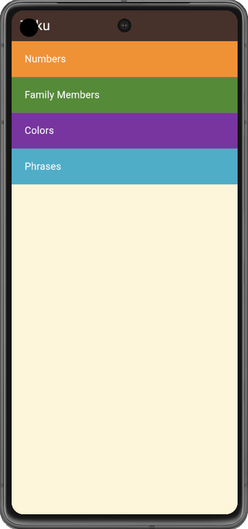

# Learning Language

This is a Flutter-based project designed as a starting point for building applications aimed at language learning. It provides a framework to create intuitive, responsive, and interactive learning experiences across multiple platforms.

## Table of Contents

- [Features](#features)
- [Screenshots](#screenshots)
- [Setup](#setup)
- [Prerequisites](#prerequisites)
- [Project Structure](#project-structure)
- [Dependencies](#dependencies)

## Features

- **Cross-Platform Support**: Runs seamlessly on Android, iOS, Web, macOS, Windows, and Linux.
- **Modular Codebase**: Organized to facilitate easy development and maintenance.
- **Flutter-Powered**: Leverages Flutter's rich set of widgets and tools for fast development and high-quality design.
  
## Screenshots
Here’s a preview of the Weather App in action:

<p align="center">
  
  
  
  
  
</p>

## Setup

This project is structured as a Flutter application. To get started:
1. **Clone the repository**
   ```bash
   git clone https://github.com/NadaAlaa1/learning_language.git
   cd learning_language

2. **Install dependencies** Ensure Flutter is installed on your system. Then, run the following command:
   ```bash
   flutter pub get

3. **Run the App**
   ```bash
   flutter run

## Prerequisites
Ensure the following are installed on your system:
- [Flutter SDK](https://docs.flutter.dev/get-started/install)
- Android Studio or Xcode (for mobile development)
- A compatible IDE or text editor (e.g., VS Code, IntelliJ IDEA)

## Project Structure

- **lib/**: Contains the main application code.
- **assets/**: Stores images, fonts, and other resources.
- **Platform Folders (android, ios, etc.)**: Platform-specific configurations.

## Dependencies

Install these dependencies by running:
```bash
flutter pub get
